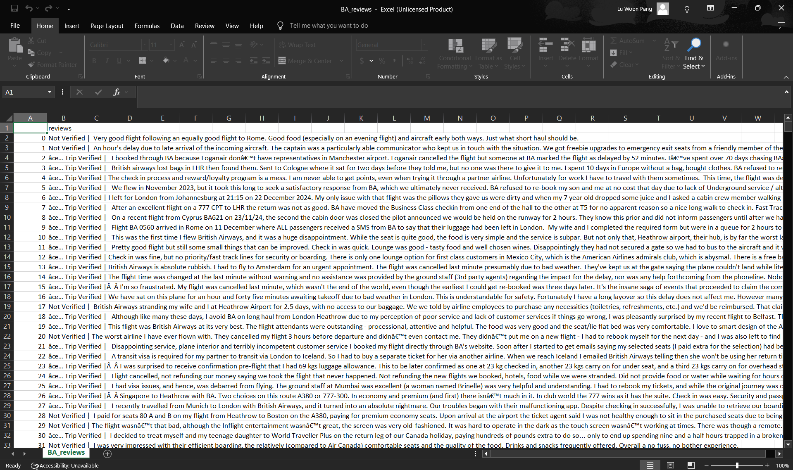
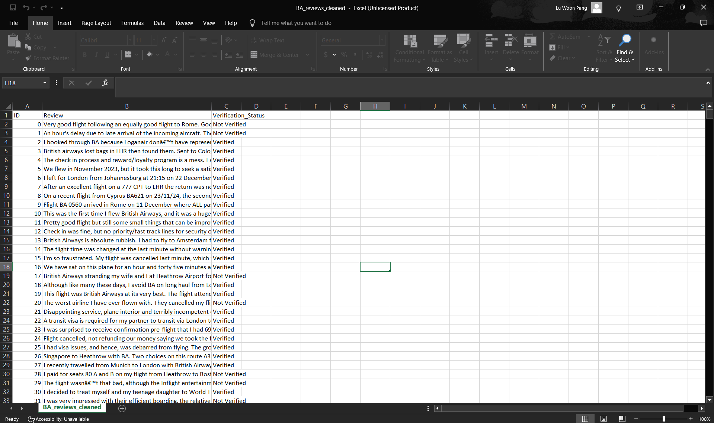
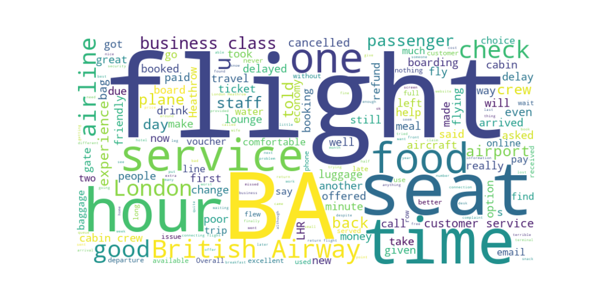
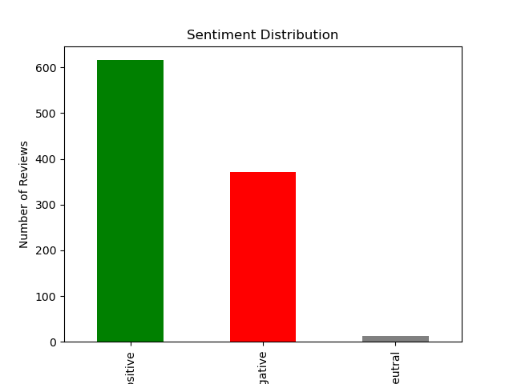
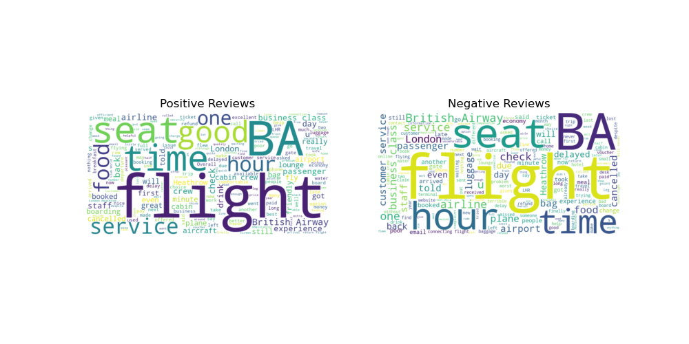
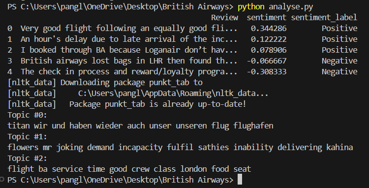

# British Airways Customer Insights Analysis

## Tools used: Python

This is a project from British Airways' job simulation on Forage. 

The first task was to scrape and collect customer feedback from a third-party source and analyse the data to uncover insights. The Beautiful Soup library was used to scrape reviews for British Airways from airlinequality.com.

A CSV file containing 1000 reviews was obtained.

The initial CSV generated was unclean as the first column was not titled and the 'reviews' column was not formatted appropriately. Steps were taken to clean the CSV file. They include splitting text into columns, trimming whitespace, and creating data groups.

After cleaning, the data was analysed. Word clouds were generated, and sentiment analysis and topic modelling were performed.

Apart from the common words such as 'flight', 'BA' and 'British Airways', some words that stand out are 'service', 'food', 'seat', 'time', 'good', and 'cancelled'.

A glimpse at the sentiment distribution shows that over 60% of the reviews were generally positive. Over 30% of the reviews were negative, and some were neutral.

Two more word clouds were generated to find out the common words used in positive and negative reviews. For positive reviews, words that stand out include 'food', 'seat', 'time', and 'service'. For negative reviews, words that stand out are 'time', 'seat', 'luggage', 'customer service', and 'cancelled'.

Based on the analysis, the following can be deduced:
* Most customers are generally satisfied with British Airways. However, a significant proportion (over 30%) of customers had negative reviews toward BA.
* The popular themes that customers provide feedback on are related to service, food, seating, and likely the punctuality of the airline.
* From the word cloud on positive reviews, customers were pleased with the food and service provided. Some appreciated the lounge and business class, and had a positive experience.
* From the word cloud on negative reviews, customers were not happy with areas including cancelled and delayed flights and the handling of luggage.
* 'Seat', 'time' and 'service' appeared in both positive and negative reviews, reflecting the differing feedback customers have.
* Considering these, it can be said that customers were satistifed with BA's food and service. Areas that did not fare as well are cancelled and delayed flights. More could be done to improve the seating, punctuality, and service, as customers tended to notice and provide feedback on these areas.
